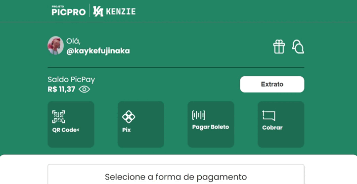

# Project Picpro (Kenzie Academy + PicPay)

> A page made jointly by Picpay and Kenzie Academy.

Check the Application: https://picpro.netlify.app
## :page_facing_up: Explanation

The project was developed at a Kenzie Academy event in partnership with Picpay. Thus, creating a project called PicPro that was taught by Kenzie Academy instructors. The event was completely free and available on Youtube for a limited time.

The project was divided into 4 days of classes. Every day was a different technology, namely: HTML, CSS and JavaScript.

- The first day they taught about structuring the page with HTML and naming it with some classes.

- The second day was a styling class that used CSS. Thus, leaving the site more beautiful and with the color of the project.

- The third day was a class separated from the project, which explained an entire class of JavaScript that would be used in the next class.

- The fourth day was the use of JavaScript in the project and giving the functions to change the section.

The design has an interesting point, as the sections were hidden with Display None, but with JavaScript we determined that they would appear when clicking on the screen.

I made the project responsive at the end of every event and fixed some bugs like the sections not being fully in accordance with the initial layout, but it is already working normally.

## 📁 Sections

The site consists of 5 different sections:

- **Home Page:** A page that shows a Picpay + Kenzie bank application;
- **QrCode Section:** It is a QrCode section to receive money;
- **Pix Section:** It is a section to send a Pix
- **Pagar Boleto Section:** It is a section to pay the boleto through the barcode;
- **Charge Section:** It's a section to pay with some friends.

## :dart: Features ##

:heavy_check_mark: Page structure;\
:heavy_check_mark: Page Styling;\
:heavy_check_mark: Using JavaScript in the Project;\
:heavy_check_mark: Fixing some bugs that weren't working the JavaScript function;\
:heavy_check_mark: Hovering the buttons;\
:heavy_check_mark: Making the site responsive;\
:heavy_check_mark: Fixing the Input bug pasted from the Pix and Charge section;\
:heavy_check_mark: Done;

## :rocket: Technologies ##

The following tools were used in this project:

- [Html](https://developer.mozilla.org/pt-BR/docs/Web/HTML/Element/html/)  
- [CSS](https://developer.mozilla.org/pt-BR/docs/Web/CSS)  
- [JavaScript](https://developer.mozilla.org/pt-BR/docs/Web/JavaScript) 
## 🤝 Collaborators

We thank the following people who contributed to this project:

<table>
  <tr>
    <td align="center">
      <a href="#">
         
        
          <b>Kayke Alves Fujinaka</b>
        
      </a>
    </td>
    <td align="center">
      <a href="#">
         
        
          <b>Pedro Henrique da Silva</b>
        
      </a>
    </td>
  </tr>
</table>

## 📝 License

This project is under license. See the [LICENSE](LICENSE.md) file for more details.

&#xa0;

<a href="#top">Back to top</a>
